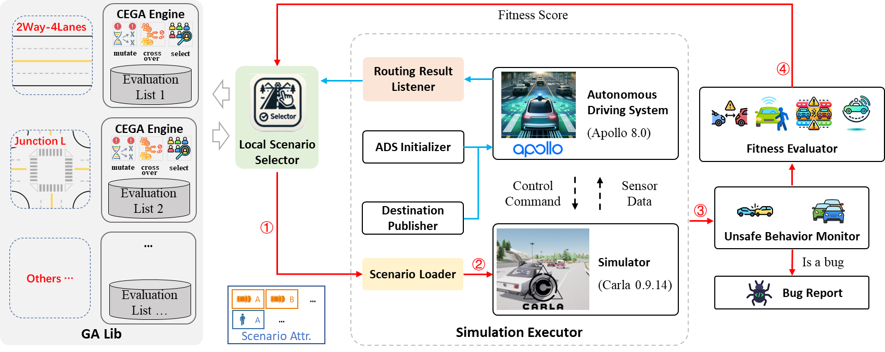

## Overview
AS-Fuzzer aims to efficiently generate numerous critical scenarios for complex road structures to uncover ADS defects. The core of AS-Fuzzer is a Genetic Algorithm (GA) that generates scenarios with random but effective traffic participants, evolving the best individuals to search for critical scenarios. The workflow is as follows:

1. AS-Fuzzer maintains a Genetic Algorithm Library (GA-Lib) containing the smallest atomic scenarios of large composite scenarios and their corresponding GAs. Each atomic scenario evolves independently, placing parameterized local scenarios requiring simulation and fitness scores into validation lists.
2. The Local Scenario Selector defines the road facilities during ADS operation, retrieving a
corresponding parameterized local scenario from the GA Lib's validation list, submitting it to the Scenario Executor for simulation, and returning the fitness scores to the Evaluation List for iterative GA cycles.
3. The Simulation Executor serves as a communication bridge between the ADS and the simulator, initializing the ADS and providing destination information. During simulation, it collects ADS route planning outputs, divides the large scenario into local scenarios based on the planned route, and sends local scenario features to the Local Scenario Selector. The Scenario Loader then instantiates and runs the parameterized local scenario in the simulator.
4. After simulating each local scenario, it is evaluated to obtain fitness scores. The Unsafe Behavior Monitor detects collisions or minor violations, recording and reporting errors.


## Usage
### Before you start
Nvidia Docker is required before you start. Please refer to the official website for installation instructions.

Carla 0.9.14 should be installed also.

```bash
docker pull carlasim/carla:0.9.14
```

Carla Apollo Bridge is required.
Please refer to the [insallation guide](https://github.com/guardstrikelab/carla_apollo_bridge/blob/master/docs/GettingStarted.md).

We have slightly customized the original [carla_apollo_bridge repository](https://github.com/guardstrikelab/carla_apollo_bridge/), mainly introducing remote control scripts for Apollo, so please use our fork version. So, when you are cloning the carla_apollo_bridge project outside Apollo container, please clone the fork version by:
```bash
# Using SSH
git clone git@github.com:cfs4819/carla_apollo_bridge.git

#Using HTTPS
git clone https://github.com/cfs4819/carla_apollo_bridge.git
```

### 2. Clone this repository and install dependencies
```bash
cd path_to_apollo/modules
git clone https://github.com/cfs4819/as_fuzz.git
```

Install dependencies in apollo container
```bash
cd path_to_apollo
./docker/script/dev_into.sh
# inside apollo container
cd /apollo/modules/as_fuzz & pip install -r requirement.txt
```

### 3. Running

```bash
# inside apollo container
cd /apollo/modules/as_fuzz
python asfuzz.py
```


## Experiment Results
Our experiments found 37 defects in Apollo, which we describe in the ['_Some key scenarios that can expose Apollo vulnerabilities generated by AS-Fuzz and baselines_'](doc/key_scenarios.md).

## Cite Our Work

If you use this code in your research, please cite our paper:
```
@inproceedings{
}
```